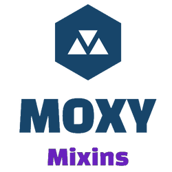

# PackageName


***Morris.Moxy*** is a code mix-in code generator for [Microsoft .NET](https://dotnet.microsoft.com/)

[](https://www.nuget.org/packages/Reducible/)

## Overview
Moxy allows you to write code templates at development time, which are then processed
as Roslyn code-generators in real-time, and the results mixed-in to target classes.

## Goal
1. Write your code patterns once.

```
namespace {{ moxy.Class.Namespace }}
{
  partial class {{ moxy.Class.Name}}
  {
    public string FullName => $"{Salutation} {GivenName} {FamilyName}"
    public string Salutation { get; set; }
    public string GivenName { get; set; }
    public string FamilyName { get; set; }
  }
}
```

2. Moxy automatically creates a .Net attribute for each pattern, which you can
   then apply to targets in your source code.

```c#
[PersonName]
public partial class Contact
{
}
```


4. The Moxy Roslyn code-generator executes the code pattern to generate additional C# code

```c#
namespace MyApp
{
    partial class Contact
    {
        public string FullName => $"{Salutation} {GivenName} {FamilyName}"
        public string Salutation { get; set; }
        public string GivenName { get; set; }
        public string FamilyName { get; set; }
    }
}
```

5. Moxy is **FAST**. Changes to the template should reflect in the code in real-time. No need to
  recompile C# source code between changes.

## Getting started

The easiest way to get started is to read the [documentation](./Docs/README.md).
Which includes tutorials that are numbered in an order recommended for learning
***Morris.Moxy***. Each will have a `README` file that explains how the tutorial was created.

## Installation
You can download the latest release / pre-release NuGet packages from the official
***Morris.Moxy*** [Nuget page](https://www.nuget.org/packages/Morris.Moxy/)

## Release notes
See the [Releases page](./Docs/releases.md) for release history.

# Licence
[MIT](https://opensource.org/licenses/MIT)
